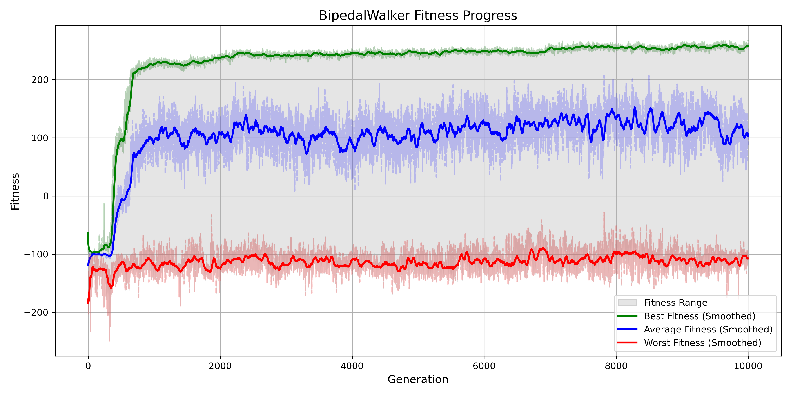

# Neuroevolution BipedalWalker-v3

This project explores how simple genetic algorithms can be used to solve reinforcement learning environments by evolving neural networks, completely bypassing traditional gradient-based methods like backpropagation.

The task tackled here is the [BipedalWalker-v3](https://gymnasium.farama.org/environments/box2d/bipedal_walker/) environment from OpenAI Gymnasium. The goal is to teach a two-legged robot how to walk across challenging terrain without falling or wasting energy.

Rather than relying on gradient descent to optimize a neural network, this implementation evolves a population of neural networks by evaluating their fitness through direct interaction with the environment.

At its core, each neural network’s weights are represented as a flat genome — a simple array of numbers. These genomes undergo mutation via Gaussian noise, crossover between parents, and are selected based on their performance in the environment. The only feedback they receive is their fitness score: how far and efficiently the agent manages to walk across the terrain.

Throughout this project, I explored different techniques for crossover, mutation, and selection, analyzing how these evolutionary choices impact learning dynamics. I experimented with multiple selection strategies (including tournament, roulette, and elitist selection), observing how they shape exploration, diversity, and convergence speed. These subtle design decisions often lead to drastically different evolutionary behaviors.

Over the course of generations, the population gradually improves. BipedalWalker is a particularly difficult environment due to its continuous action space, unstable dynamics, and the need for smooth, coordinated control. This project demonstrates how evolutionary strategies can succeed even in high-dimensional, continuous control problems — without gradients, backpropagation, or even differentiable models.

## How it works

The agent uses a compact feedforward neural network with one or two hidden layers. It receives 24 continuous inputs from the environment (such as hull angle, joint speeds, leg contacts, and lidar distances), and outputs 4 continuous motor torques to control the walker’s hips and knees.

The training loop evaluates each genome by running full episodes in the BipedalWalker environment. The fittest individuals are selected and used to generate the next generation through crossover and mutation. Weaker performers are discarded. This evolutionary loop drives the population toward increasingly effective and stable walking behaviors.

Typical progress across generations looks like this:

Early generations: walkers fall over instantly, twitch erratically, or jump off balance.

Mid generations: walkers begin moving forward clumsily but with some coordination.

Later generations: walkers exhibit smooth, efficient, and stable locomotion across terrain.

<p align="center">  </p>

## Results

Despite its simplicity, the genetic algorithm is capable of producing highly competent walking agents after enough generations. The neural networks discover stable locomotion patterns purely through mutation, selection, and survival pressure — with no gradient information, supervision, or external guidance.

The best agents can be saved and visualized. Here's an example of a successful walking sequence generated entirely through evolution:

<p align="center">  </p>

## Why this project

The motivation behind this project is to explore neuroevolution as a viable and elegant alternative to conventional reinforcement learning. In environments like BipedalWalker, where actions are continuous and control is delicate, neuroevolution remains a surprisingly powerful approach.

While not as sample-efficient as policy gradient methods, genetic algorithms offer simplicity, parallelizability, and robustness — making them particularly appealing for experimentation and education.

This project serves as a minimal but complete demonstration of how evolutionary methods can solve complex control problems in reinforcement learning, and lays the groundwork for extending toward more advanced evolutionary strategies or harder environments.

## Dependencies

To run this project, install the dependencies with the following command:

```bash
pip install -r requirements.txt
```


